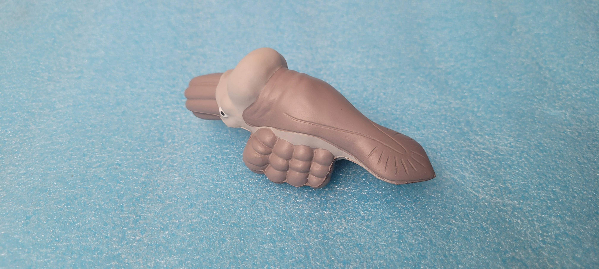

# FineTuningSD
Playing with fine tuning SD.
Object photo example:

Examples of source data:

1) LORA Dreambooth based on [example made by Huggingface](https://huggingface.co/docs/diffusers/main/en/training/lora)
LR: 1e-4, train steps: 15000 time: 10h 39 min
  Results:
