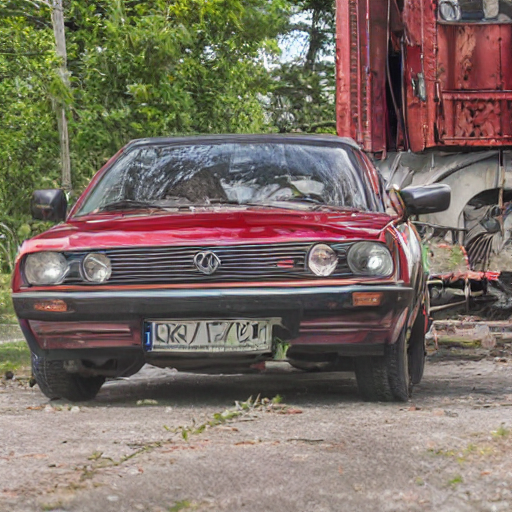
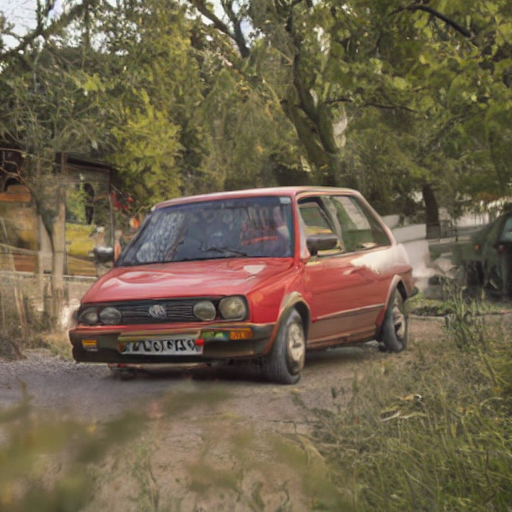
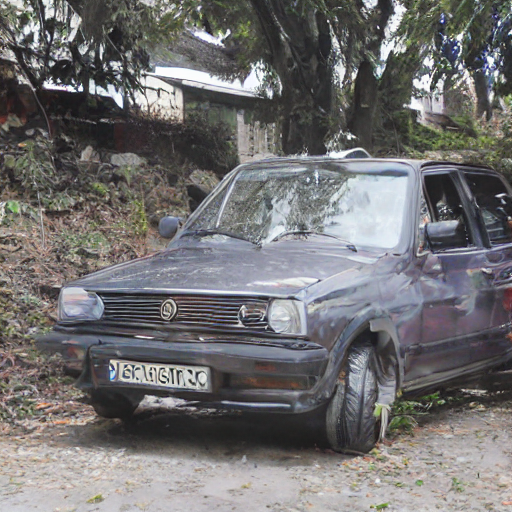
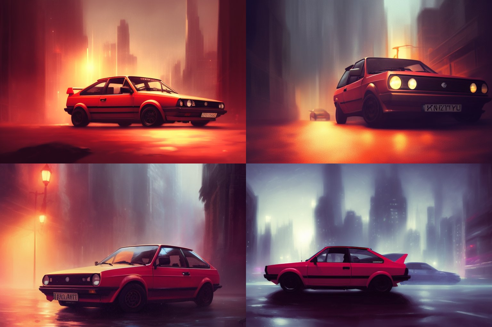
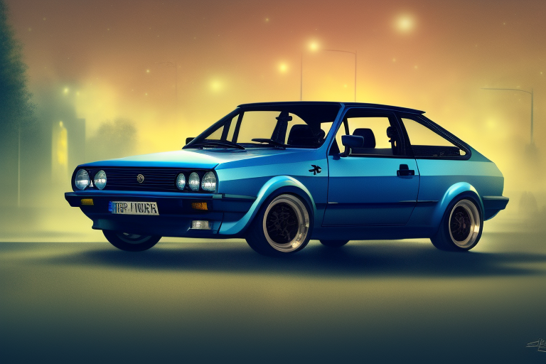
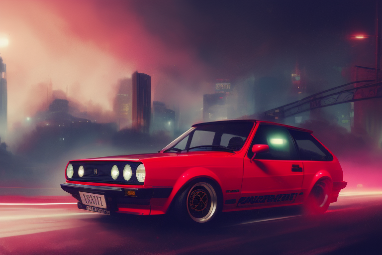
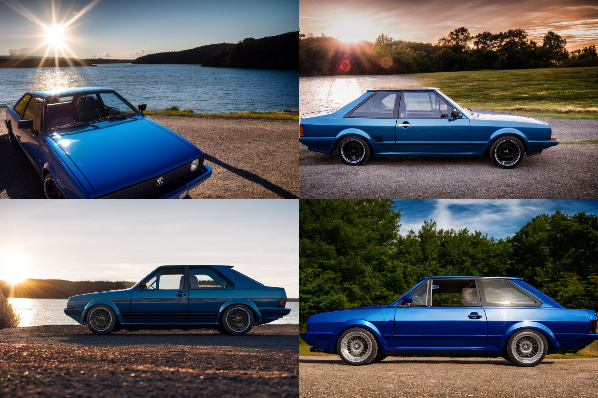
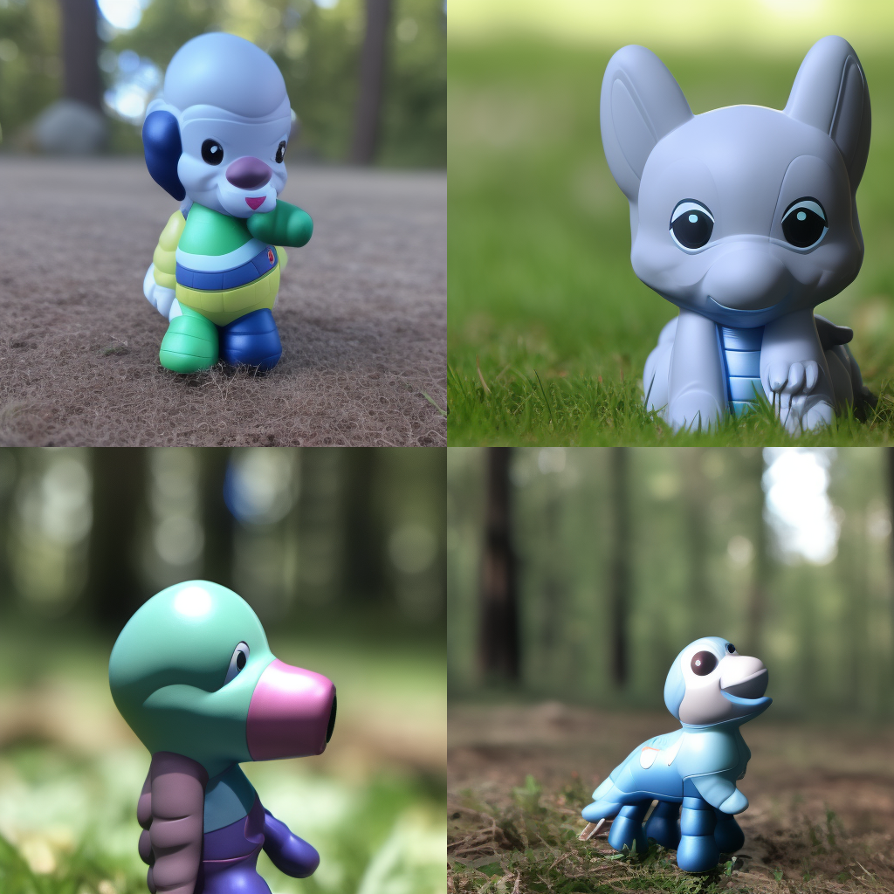
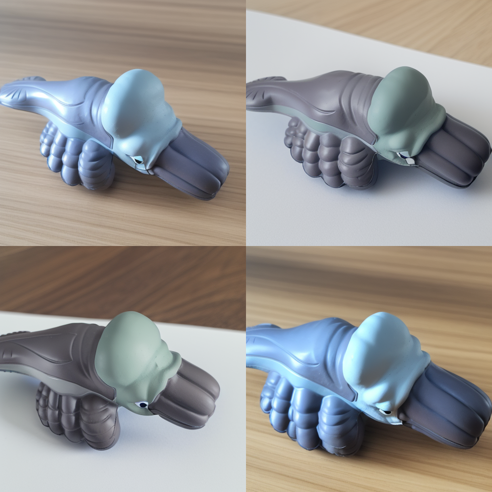

# FineTuningSD
Playing with fine tuning SD.
Object photo example:

Examples of source data:

1) LORA Dreambooth based on [example made by Huggingface](https://huggingface.co/docs/diffusers/main/en/training/lora) 
LR: 1e-4, train steps: 15000 time: 10h 39 min 
The network generates great images, but model is not able to generate new content, e.g. "toy swimming in water". It is a great generator of images that look exactly as training examples. It is able to generate something new if scale in cross_attention_kwargs would is lowered, but this is not possible, while the trained text encoder was loaded.
  Results:  

2) Same, but disabled text encoder fine-tuning 
LR: 5e-5, train steps: 19600 time: 12h 12 min  
prompt: "A photo of an sks toy flying in space, on orbit, professional, highly detailed, national geographic" 
Skipping the training of text encoder and loading only u-net makes it possible to generate some fun results. They are way less correct and more deformed. Maybe this is due to abstract nature of the toy, next step is to test it with something less... unusual.
  Results:  

3) Tried to teach something less weird: WV Polo. It's not perfect still.. Time to try something else. The prompt is still ignored if network was loaded with load_lora_weights 
LR: 1e-4, train steps: 19600 time: 12h 12 min  
prompt: "A photo of sks car on a race track" 
  Results:  

4) SD-Scripts Dreambooth: way better results on WV 
LR: 1e-7, train steps: 2000 time: ~45 min  
  Results:  

### How to train Dreambooth with SD-Scripts:

- Create toml file - see templates/db_toml_template.toml
- Create .sh file - see templates/dreambooth.sh
- Create captions for training and reg images - tag_images_by_wd14_tagger.py in sd-scripts: python tag_images_by_wd14_tagger.py --caption_extention=.caption --batch_size=4 /data/dir
- Add text with code and class to begining of each caption: sed -i '1s/^/An shs toy /' *.caption
- Run the .sh file

5) SD-Scripts Dreambooth on Squab toy: Learns to create toy "in style of" squab fast, but then overfits on enviro. I'll try with more varied images. 
  Results:  